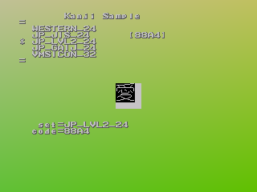

# SEGA Dreamcast bootROM Font Unpacker

A small python script to unpack all the glyphs from the Dreamcast bootROM embeded fonts.

## Purpose

While working on the custom bootROM, I needed specific characters and didn't really know whether they had a representation in the bootROM fonts.

Additionally, giving a way extract the glyphs could help designing new fonts for our beloved Dreamcast.

## Getting started

### Requirements

* Python 3.10+

### Prepare your environment

```bash
python3 -m venv venv
. ./venv/bin/activate
pip install -r requirements.txt
```

### Usage

```bash
./font-unpacker.py --help
Usage: font-unpacker.py [options] bootROM.bin

Unpack all bootROM font glyphs

Options:
  -h, --help     show this help message and exit
  -f, --font-id  Read only the font ID
  -d, --debug    Change logger level to 'DEBUG'
```

### Example

```bash
$ ./font-unpacker.py bootROM_v1.01d.bin
font-unpacker INFO: Opening bootROM 'bootROM_v1.01d.bin'
font-unpacker INFO: Font ID @0x00100018 is FNT90427
font-unpacker INFO: Creating output directory 'output/FNT90427'
font-unpacker INFO: Unpacking 7bit fontset ascii glyphs in output/FNT90427/7bit/ascii
font-unpacker INFO: Unpacking 8bit fontset iso-8859-1 glyphs in output/FNT90427/8bit/iso-8859-1
font-unpacker INFO: Unpacking 8bit fontset jis-x-0201 glyphs in output/FNT90427/8bit/jis-x-0201
font-unpacker INFO: Unpacking 16bit fontset jis-x-0208 glyphs in output/FNT90427/16bit/jis-x-0208
font-unpacker INFO: Unpacking 16bit fontset sega-gaij glyphs in output/FNT90427/16bit/sega-gaij
font-unpacker INFO: Unpacking 16bit fontset sega-vmu-icon glyphs in output/FNT90427/16bit/sega-vmu-icon
font-unpacker INFO: Done.
```

## Technical details

A glyph is the graphic representation of a character and the Dreamcast bootROM contains a section made up of series of glyphs that can be used by a software to display Latin, Japanese as well as SEGA specific graphics on the screen.

### Glyphs layout


### SEGA Dreamcast Fontsets

The *SEGA KATANA R9 SDK* has a sample application that let you pick-up a fontset, set a char code in the selected fontset:



This application, just like any other commercial games developed with the SEGA SDKs, relies on the `sg_byFnt` library which defines the following charsets (or fontsets):

| SEGA charset name | Closest charset in computer wording                  |
|:-----------------:|------------------------------------------------------|
| **WESTERN_24**    | a subset of *ISO 8859-1*                             |
| **JP_JIS_24**     | *JIS X 0201* with extensions                         |
| **JP_LVL2_24**    | a subnet of *JIS X 0208* (also known as *Shift JIS*) |
| **JP_GAIJ_24**    | N/A, SEGA proprietary charset for controller icons   |
| **VMSICON_32**    | N.A, SEGA proprietary charset for VMU icons          |

### General comment about charsets

A charset, from code point of view, is nothing but the mapping of a code, encoded on either 7, 8 or 16 bits depending on the charset, to a glyph, all done in a not so bad way to optimize the lookup and avoid glyph duplication. From one charset to another, you usually don't have the exact same set of characters represented as each was designed for a specific usage or language. It was especially true before Unicode standard came in. That said, the charsets, in general, try to have some sort of interoperability, so that a range of codes in one charset can be handled or understood by another one without complex transformations.

### The `¥` and the `‾` glyphs 

You may have noticed that the `¥` and the `‾` glyphs in the glyphs layout surround the 7-bit ASCII glyphs. I am not sure about the real reasons behing this but at least I think I understand a part of it.

There is a certain logic in the code-glyph mapping. For instance, given the *ISO 8859-1* charset, a `0x41` char code leads to the glyph of the letter `A` and `0x42` to the glyph of the letter `B`. *JIS X 0201* charset re-uses a part of the *ISO 8859-1* charset, meaning that in our example the code for the letter `A` is also `0x41`. So far so good. With a quick look at the character tables you will easily come to the conclusion that the codes in the `0x20-0x7f` range, coding for 7-bit ASCII characters, are (almost!) similar in both *ISO 8859-1* and *JIS X 0201* charsets. It means that the code that does the mapping for *JIS X 0201* does not really have to do much for handling this range, it just has to delegate it to the code that handles 7-bit ASCII characters. Smart, right?

Previously, I said that the codes were almost similar. Indeed! Now take the `0x5c` and `0x7e` char codes. In *ISO 8859-1*, those two char codes code for `\` (backslash) and `~` (tilde) glyphs, respectively. For interoperability sake, *JIS X 0201* re-uses the same ASCII 7-bit code mapping for codes between the `[0x20;0x7f]` range and extends its with the `[0xa0;0xdf]` range for Japanase kana. However, the JIS committee decided that those two char codes would now code for `¥` (yen sign) and `‾` (overline) glyphs (see the *JIS X 0201* Wikipedia page). So now, assuming you want to make *ISO 8859-1* the default unaltered charset, and also want to support the *JIS X 0201* one and factorize the glyphs to use as much as possible, you have to change your code mapping for those two codes so that they are mapped to two new glyph locations. Based on the `sg_byFnt` library, SEGA seems to have replaced the standard ASCII space character `0x20` with the overline character and appended the yen sign right after the last known ASCII 7-bit printable character, i.e. the character you could have obtained with the `0x7f` ASCII 7-bit code. But what about the ASCII space character `0x20` then? An additional mapping fixes it: the `0x20` code in *ISO 8859-1* returns the same glyph as for the `0xa0` code, the non-breaking space glyph which in the case of the Dreamcast bootROM font is a blank glyph. Problem solved (phew!).

## TODOs

* Generate an HTML page to visualize the glyphs, gather them in fontsets and detail the code mapping
* Pack PNGs to create a new font

## Resources

* http://mc.pp.se/dc/syscalls.html#vecB4
* https://github.com/KallistiOS/KallistiOS
* https://www.ascii-code.com/ISO-8859-1
* https://en.wikipedia.org/wiki/JIS_X_0201
* https://en.wikipedia.org/wiki/JIS_X_0208
* https://en.wikipedia.org/wiki/Katakana
* https://japanese-cake.io/
